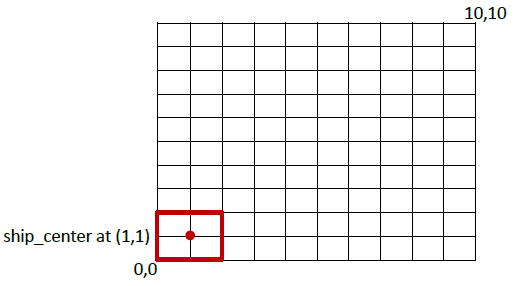

# Lab 8 - Battleship

In this lab, you will develop the Battleship game by following the tasks below.
1. Create a structure called Point that has two members (posX, posY).
2. Use the nested structure to create a structure called Ship that has the following members:
  a. ship_center – center location of the ship
  b. ship_location – contain all 9 locations on the ship (see figure)
  c. num_hit – number of hits by the bomb
  d. is_equals – a function to compare location of the bomb to location of the ship
  e. cal_location – a function to calculate all 9 locations on the ship
3. The ship can only locate inside the grid between (0,0) and (10,10).
  a. The ship size covers 2x2 grid (see figure below).
  b. The center location of the ship is the middle point of the 2x2 grid.
  c. This implies that the ship center only allows to be located between (1,1) and (9,9).
4. When the game starts, the program will prompt the user to enter the center location of the ship.
5. All 9 positions on the ship (grid positions) will be calculated and stored in the ship_location (Hint: It might be a good idea to use vector for this variable).
6. User will be prompted to enter the bomb location.
7. The location of the bomb will be compared to the location of the ship. If they are equal, number of hits by the bomb will be increased.
8. If number of hits is equal to 3 (three). The ship is sunk. The program will ask if the user wants to play the game again.
9. You are on your own to develop the interface for the user to interact with your program.

## Submission

Submit your source file (.cpp) and zip of the executable file (.exe) in the Dropbox in D2L. There will be 2 files in total.